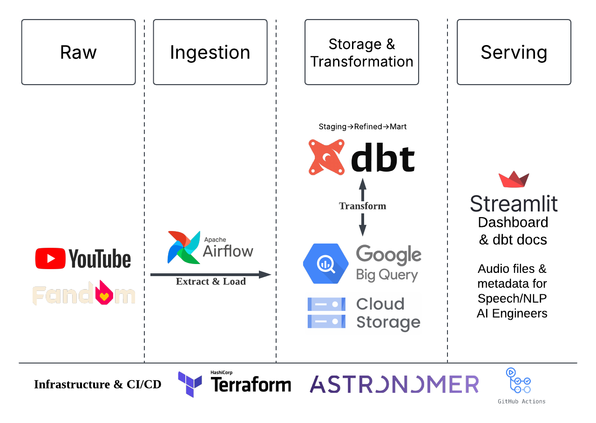

## **LoL Esports Voice Analytics**

## **Problem Statement**

In League of Legends esports (LoLEsports), communicatio audio is private - kept by teams and Riot Games, limiting analysis to structured data like in-game stats. This was up until recently when a newly formed team started sharing all their practice data to the public. AI-driven speech analysis can now extract insights from unstructured audio, helping teams assess shot-calling, efficiency, and strategy.

## **Opportunity**

Los Ratones, a recently formed 2nd-tier EMEA team, is now publicly sharing full in-game voice communications on YouTube, which offers a new opportunity for open-source development of AI tools to analyze team communication, benefiting teams, analysts, and fans alike.

### **Primary Goals**

- Develop visualizations and analytics that uncover communication patterns and dynamics, providing Los Ratones with actionable insights to enhance their gameplay
- Analyze audio from esports practices to pinpoint strengths and areas for improvement in team communication, enabling targeted feedback to refine decision-making and in-game strategies

**Secondary Goals**

- Contributing to the open source speech AI community by sharing a pipeline for audio data from a multi-speaker, dynamic environment to aid in the development of speech diarization models for such settings
- Setting up a pipeline to extract and transform raw audio data from YouTube and serve as a guideline for Esports teams to set up their own pipelines

### **Conceptual Data Model**

- **Audio:** Extracted from videos, storing technical properties and linked to game transcriptions for further analysis.
- **Game Transcription:** Includes AI-generated text derived from audio, summaries, clarity levels, and hype metrics.
- **Video:** YouTube video containing in-game communications for a team.
- **Team:** Represents a lolesports team, linking to player names and the league they belong to.

### **Datasets**

- Los Ratones game videos are taken from [Nemesis 2](https://www.youtube.com/@Nemesis2_lol/playlists) - a youtube channel run by one of the players. Scrim videos are uploaded in the Scrims playlist, usually 3-4 a week. Each video contains 4-6 games.
- Team information is web scraped from [LoL Fandom](https://lol.fandom.com/wiki/League_of_Legends_Esports_Wiki) - a Wikipedia website for everything related to LoL.

As mentioned, this is the first *public* source of such data so the Nemesis 2 youtube channel is the only place available to obtain such data for *any* team. The LoL Fandom website is the most popular general LoL information website, it is well-maintained and reliable for team information.

### **Technology**

The technology choices are a mix of new challenges, ease of setup, and comfort.

- Airflow connected to Astronomer is used for ingestion. The github repository is linked to the project so changes in the `/airflow` directory are immediately reflected in the deployment. The pipeline to ingest videos is set up to run daily checking for new videos
- Google Cloud Platform tools are deployed using Terraform for easy deployment/change/removal
- Google Cloud Storage is used as a data lake, which is good for unstructured data like audio files and transcriptions jsons
- Google BigQuery is used as a data warehouse to store team information and raw information about the ingested videos
- dbt is used to interact with BQ in order to refine and produce final versions of the raw data ingested with Airflow. dbt build is set up to run the models related to raw video data on a daily basis using Github Actions. [dbt docs are also deployed using Github Actions](https://divakaivan.github.io/lolesports-voice-analytics)
- Alongside the audio files and metadata, which can be used for model training by downstream stakeholders, [a Streamlit dashboard is deployed automatically on changes to the `/visualisation` directory](https://lolesports-voice-analytics.streamlit.app/). Streamlit is used over other visualisation tools, because it's easy to set up and produce python-based graphs

### **Pipelines**

**Extract & Load Data**

- Audio files (.wav) and transcription (.json) are uploaded to Google Cloud Storage, and one big table including all metadata about the ingested video, its content, audio files references, transcriptions is upsert into BigQuery
- Team data is ingested directly into BigQuery
- Data quality checks before loading:
    - video length check (e.g., scrim videos are usually > 1.5hrs)
    - checking there are 'Chapters (Games)' in the description
    - prevent double-processing
    - schema validation check before upload to the data lake

- Google Cloud Storage:

- GCP BigQuery:

- Astronomer Deployment:

All Airflow DAGs:

Video processing DAG:

Team scraping DAG:

**Data Transformation**

Using dbt, data goes through a transformation and DQ check pipeline

- Staging (STG_) data mimics the source data 99% (e.g., column are renamed)
- Refined (REF_) data is where business logic is applied (e.g., create game-based statistics)
- Marts (MART_) data is where data is split into different entities following the conceptial data model

Data quality tests (not null, not empty, data types, value range) are applied at every step.

### **Key Metrics of Interest**

| **Metric**                     | **Definition**                                                                                                                                                           | **Scale/Range**                                                                                      | **Source/Notes**                                                                                                           |
|--------------------------------|--------------------------------------------------------------------------------------------------------------------------------------------------------------------------|------------------------------------------------------------------------------------------------------|----------------------------------------------------------------------------------------------------------------------------|
| Communication Clarity          | How clear the communication was during the game, indicating ease of understanding.                                                                                       | 1 (low) to 5 (high)                                                                                  | AI-generated score (e.g., GPT_CLARITY)                                                                                     |
| Communication Intensity        | The intensity of the emotion expressed during communication in the game.                                                                                                 | 1 (low) to 5 (high)                                                                                  | AI-generated score (e.g., GPT_INTENSITY)                                                                                   |
| Word Count                     | The number of words spoken during a game, reflecting the volume of communication (e.g., win vs defeat scenarios).                                                         | Integer count (e.g., 1500 words)                                                                     | Derived from transcript analysis (via tokenization and adjusting for average token length)                                 |
| Top Bigrams                    | The most frequent two-word combinations extracted from the transcript, highlighting key phrases or recurring themes.                                                      | List of bigrams with frequency counts (e.g., "game over": 15)                                          | Extracted using NLP techniques (bigram frequency analysis, stop-word filtering, and significance checks)                   |
| Temporal Cross-Game Variation  | Compares key communication metrics (e.g., clarity, intensity) within a predefined time frame across multiple games. This metric assesses the consistency or variability in behavior between games. | 1 (minimal variation/high consistency) to 5 (high variation/low consistency)                         | E.g. comparing the 1st five minutes of a game with another game's first five minutes |

### [**Dashboard**](https://lolesports-voice-analytics.streamlit.app/)

### **Challenges**

- The pytube package, which extracts data from the YouTube API, is in a constant struggle with the API, as YouTube actively prevents bots from extracting data. When pytube is used in a cloud environment, it fails 95% of the time with an error stating that the request was detected as a bot. Which presented a challenge to run my main pipeline in the cloud. Locally this issue does not exist
- The better whisper transcription models require more memory, so in order to load the model, I had to choose a smaller size version in order to fit it in memory, and as a result the transcriptions took longer
- OpenAI whisper requires an API key and funds in order to use it

### **Future Enhancements**

- The pytube package bot issue can be avoided by using a proxy server. In the future setting up a proxy through some 3rd party provider could help avoid the 'bot detected' errors when running from cloud environments
- Use a more powerful machine for the Airflow deployment so that we can load a bigger model. Or use the model through API calls
- I wanted to set up player-specific communication tendencies, and tried `pyannote/speaker-diarization-3.1` from HuggingFace during development. However, given the dynamic, multi-speaker nature of the audio the model did not perform well. In the future, I hope to use audio data as in this project to further improve speaker diarization models
