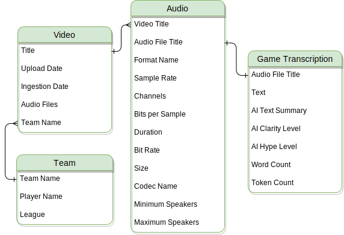

## **LoL Esports Voice Analytics**

## **Problem Statement**

In League of Legends esports (LoLEsports), communicatio audio is private - kept by teams and Riot Games, limiting analysis to structured data like in-game stats. This was up until recently when a newly formed team started sharing all their practice data to the public. AI-driven speech analysis can now extract insights from unstructured audio, helping teams assess shot-calling, efficiency, and strategy.

## **Opportunity**

Los Ratones, a recently formed 2nd-tier EMEA team, is now publicly sharing full in-game voice communications on YouTube, which offers a new opportunity for open-source development of AI tools to analyze team communication, benefiting teams, analysts, and fans alike.

### **Primary Goals**

- Develop visualizations and analytics that uncover communication patterns and dynamics, providing Los Ratones with actionable insights to enhance their gameplay
- Analyze audio from esports practices to pinpoint strengths and areas for improvement in team communication, enabling targeted feedback to refine decision-making and in-game strategies

**Secondary Goals**

- Contributing to the open source speech AI community by sharing a pipeline for audio data from a multi-speaker, dynamic environment to aid in the development of speech diarization models for such settings
- Setting up a pipeline to extract and transform raw audio data from YouTube and serve as a guideline for Esports teams to set up their own pipelines

### **Conceptual Data Model**

- **Audio:** Extracted from videos, storing technical properties and linked to game transcriptions for further analysis.
- **Game Transcription:** Includes AI-generated text derived from audio, summaries, clarity levels, and hype metrics.
- **Video:** YouTube video containing in-game communications for a team.
- **Team:** Represents a lolesports team, linking to player names and the league they belong to.

### **Pipelines**

**Extract & Load Data**

- Audio files (.wav) and transcription (.json) are uploaded to Google Cloud Storage, one big table including all metadata about a video, its content, files, transcriptions is upsert into BigQuery
- Team data is ingested directly into BigQuery
- Data quality checks before loading:
    - video length check (e.g., scrim videos are usually > 1.5hrs)
    - checking there are 'Chapters (Games)' in the description
    - prevent double-processing
    - schema validation check before upload to the data lake

All Airflow DAGs:

Video processing DAG:

Team scraping DAG:

**Data Transformation**

Using dbt, data goes through a transformation and DQ check pipeline

- Staging (STG_) data mimics the source data 99% (e.g., column are renamed)
- Refined (REF_) data is where business logic is applied (e.g., create game-based statistics)
- Marts (MART_) data is where data is split into different entities following the conceptial data model

Data quality tests (not null, not empty, data types, value range) are applied at every step.

### Key Metrics of Interest

| **Metric**                     | **Definition**                                                                                                                                                           | **Scale/Range**                                                                                      | **Source/Notes**                                                                                                           |
|--------------------------------|--------------------------------------------------------------------------------------------------------------------------------------------------------------------------|------------------------------------------------------------------------------------------------------|----------------------------------------------------------------------------------------------------------------------------|
| Communication Clarity          | How clear the communication was during the game, indicating ease of understanding.                                                                                       | 1 (low) to 5 (high)                                                                                  | AI-generated score (e.g., GPT_CLARITY)                                                                                     |
| Communication Intensity        | The intensity of the emotion expressed during communication in the game.                                                                                                 | 1 (low) to 5 (high)                                                                                  | AI-generated score (e.g., GPT_INTENSITY)                                                                                   |
| Word Count                     | The number of words spoken during a game, reflecting the volume of communication (e.g., win vs defeat scenarios).                                                         | Integer count (e.g., 1500 words)                                                                     | Derived from transcript analysis (via tokenization and adjusting for average token length)                                 |
| Top Bigrams                    | The most frequent two-word combinations extracted from the transcript, highlighting key phrases or recurring themes.                                                      | List of bigrams with frequency counts (e.g., "game over": 15)                                          | Extracted using NLP techniques (bigram frequency analysis, stop-word filtering, and significance checks)                   |
| Temporal Cross-Game Variation  | Compares key communication metrics (e.g., clarity, intensity) within a predefined time frame across multiple games. This metric assesses the consistency or variability in behavior between games. | 1 (minimal variation/high consistency) to 5 (high variation/low consistency)                         | E.g. comparing the 1st five minutes of a game with another game's first five minutes |

TODO:

Dataset and technology choices, with justifications
Steps followed and challenges faced
Possible future enhancements
